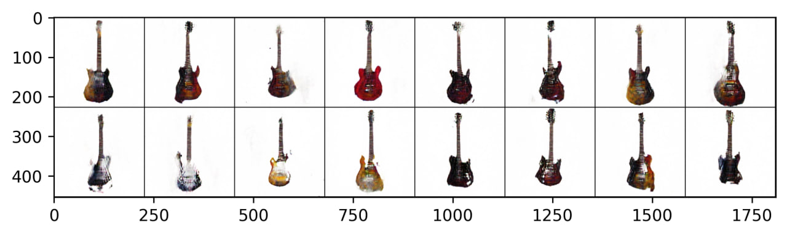

Neuroguitars
==============================

Using DCGAN for generating electroguitar images

## Usage

### Downloading data

Download images by using src/make_dataset.py

```
python make_dataset.py --load_config_path ../configs/load_config.yaml
```

### Data preparation

All the data preparation is manual. For better results use only images with white background and rotate the images untill the guitars make 90 degrees angle

### Fit DCGAN

Run training by using src/train.py

```
python train.py --model_config_path ../configs/model_config.yaml
```

### Generate images

Generate samples by using src/inference.py

```
python inference.py --model_config_path ../configs/model_config.yaml
```

Project Organization
------------

    ├── LICENSE
    ├── Makefile           <- Makefile with commands like `make data` or `make train`
    ├── README.md          <- The top-level README for developers using this project.
    ├── data
    │   ├── external       <- Generated images.
    │   └── raw            <- Downloaded images.
    │
    ├── docs               <- A default Sphinx project; see sphinx-doc.org for details
    │
    ├── models             <- Trained and serialized models.
    │
    ├── notebooks          <- Jupyter notebooks.
    │
    ├── references         <- Data dictionaries, manuals, and all other explanatory materials.
    │
    ├── reports            <- Generated analysis as HTML, PDF, LaTeX, etc.
    │   └── figures        <- Generated graphics and figures to be used in reporting
    │
    ├── requirements.txt   <- The requirements file for reproducing the analysis environment, e.g.
    │                         generated with `pip freeze > requirements.txt`
    │
    ├── setup.py           <- makes project pip installable (pip install -e .) so src can be imported
    ├── src                <- Source code for use in this project.
    │   ├── __init__.py    <- Makes src a Python module
    │   │
    │   ├── data           <- Tools for data manipulation
    │   │   └── data.py
    │   │
    │   ├── models         <- Tools for modeling
    │   │   └── model.py
    │   │
    │   ├── visualization  <- Tools to create exploratory and results oriented visualizations
    │   │   └── visualize.py
    │   │
    │   ├── make_dataset.py    <- Script to download or generate data
    │   │
    │   ├── train.py           <- Script to train model   
    │   │
    │   └──inference.py       <- Script to use trained models to make predictions   
    │   
    └── tox.ini            <- tox file with settings for running tox; see tox.readthedocs.io


--------

<p><small>Project based on the <a target="_blank" href="https://drivendata.github.io/cookiecutter-data-science/">cookiecutter data science project template</a>. #cookiecutterdatascience</small></p>
